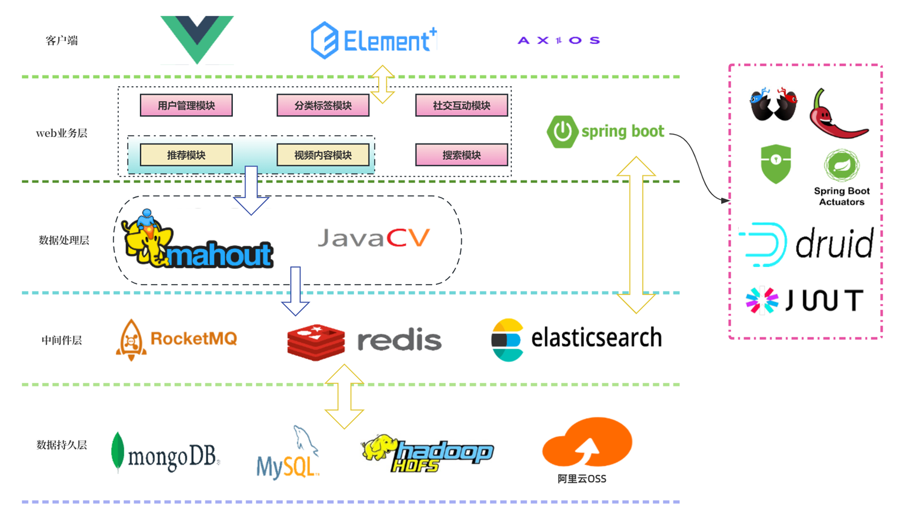
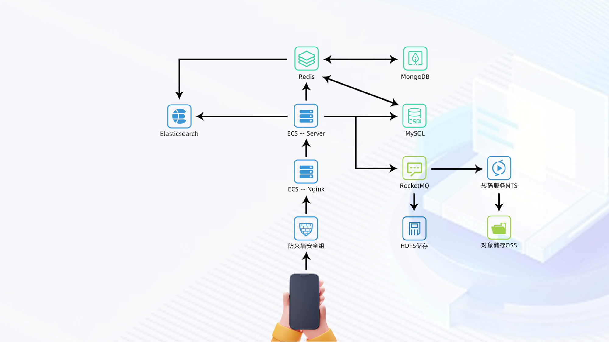

### 项目简介

**开发运行环境:**

|             软件              |     版本      |
|:---------------------------:|:-----------:|
|          Windows11          |    22H2     |
|             JDK             | corretto-17 |
|   MySQL Community Edition   |   8.0.33    |
| Windows Subsystem for Linux |      2      |
|       Ubuntu-Preview        |      2      |
|            Redis            |   7.0.11    |
|          WebStorm           |  2023.1.2   |
|          DataGrip           |  2023.1.2   |
|       Navicat Premium       |    16.15    |
|   IntelliJ IDEA Ultimate    |   2023.2    |
|           阿里云OSS            |             |
|           MongoDB           |    6.0.8    |
|        Elasticsearch        |    8.8.2    |
|          RocketMQ           |    5.1.3    |
|           Hadoop            |    2.7.1    |

***项目使用技术:***

|                  依赖                  |   版本    |
|:------------------------------------:|:-------:|
|             Spring Boot              |   3.1   |
|     spring-boot-starter-security     |  3.1.0  |
|       spring-boot-starter-web        |  3.1.0  |
|     mybatis-spring-boot-starter      |  3.0.2  |
|          mysql-connector-j           | 8.0.33  |
|                lombok                | 1.18.26 |
|         spring-security-test         |  6.1.0  |
|    spring-boot-starter-validation    |  3.1.0  |
|      mybatis-plus-boot-starter       | 3.5.3.1 |
| knife4j-openapi2-spring-boot-starter |  4.1.0  |
|         spring-security-core         |  6.1.0  |
|       spring-boot-starter-mail       |  3.1.0  |
|    spring-boot-starter-data-redis    |  3.1.0  |
|               fastjson               | 2.0.31  |
|     spring-boot-starter-actuator     |  3.1.0  |
|      druid-spring-boot-starter       | 1.2.18  |

...... 等

### 数据库E-R图

### 系统架构图

### 部署架构图

